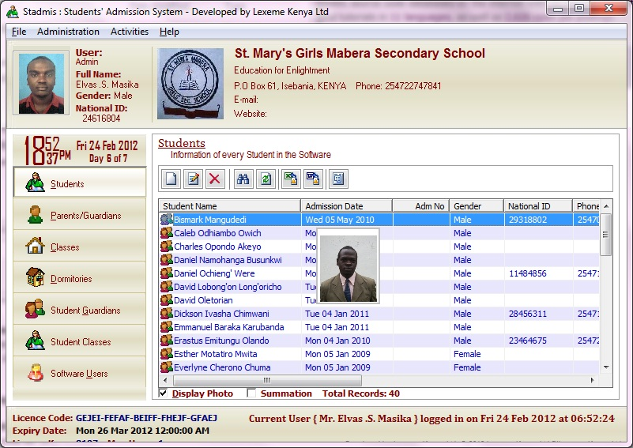



## Students Admission System

### Description

This is a Students Admission System. Stores students information, their guardians/parents, class levels, sports, clubs, societies, leadership... just check it out. Dont forget to vote

STADMIS UNLOCK CODES

I developed Stadmis Software in such a way that when first run on any machine it requests for

the unlock code, which sets it to trial version running for 30 days. I programmed the unlock code

in such a way that each day of the week has its own code as follows:

078078065 - Sunday

0DC0780C9 - Monday

14007812D - Tuesday

1A4078191 - Wednesday

2080781F5 - Thursday

26C078259 - Friday

2D00782BD - Saturday

I have a Keygen that generates a set of codes which defines the Software's:-

1. Serial Code

2. Serial key

3. Licence Code

4. Expiry date

5. Max No of Users created in the software

This serial code provided is unique for every computer that the software runs on. Therefore, it can

not work on any other machine by virtue of copy pasting. The serial key is programmatically generated

and is unique for every machine too. By use of the Keygen, a serial code can be provided that alters

any of those details. If a fake Serial credential is detected by the software, the license is revoked.

For more information contact me: elvasmasika@lexeme-kenya.com
 
### More Info
 

             |
---                |---
**Submitted On**   |2012-02-23 23:10:38
**By**             |[Maselv](https://github.com/Planet-Source-Code/PSCIndex/blob/master/ByAuthor/maselv.md)
**Level**          |Advanced
**User Rating**    |4.4 (22 globes from 5 users)
**Compatibility**  |VB 6\.0, VB Script, VBA MS Access, VBA MS Excel
**Category**       |[Complete Applications](https://github.com/Planet-Source-Code/PSCIndex/blob/master/ByCategory/complete-applications__1-27.md)
**World**          |[Visual Basic](https://github.com/Planet-Source-Code/PSCIndex/blob/master/ByWorld/visual-basic.md)
**Archive File**   |[Students\_A2220492242012\.zip](https://github.com/Planet-Source-Code/maselv-students-admission-system__1-74283/archive/master.zip)

